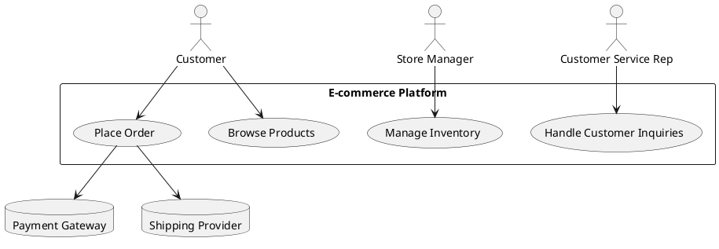
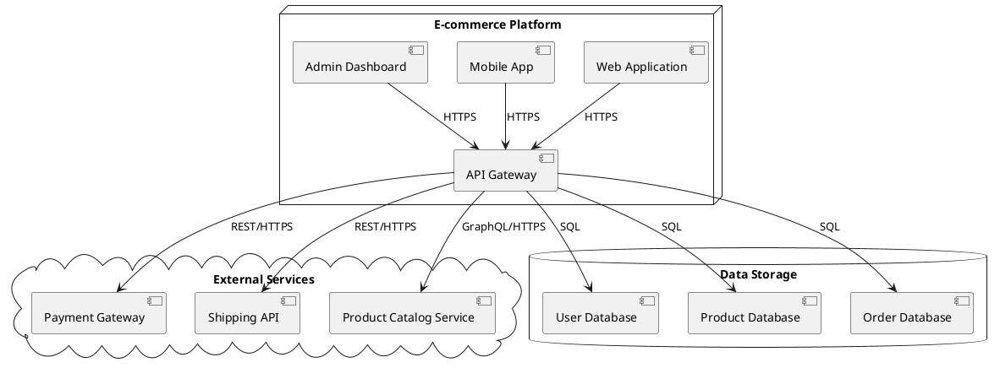
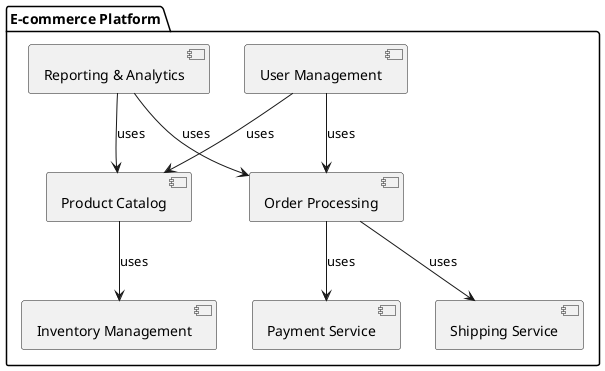
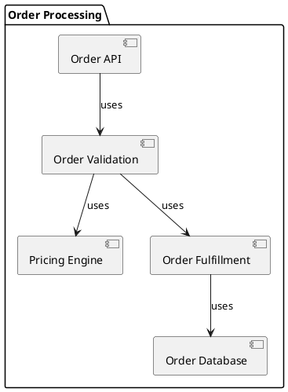
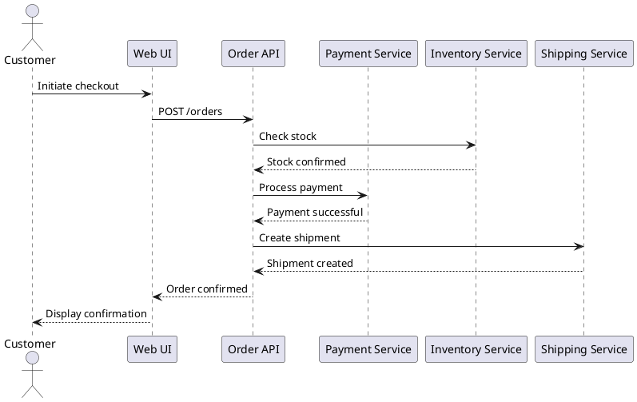
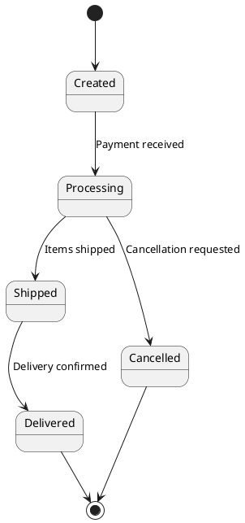
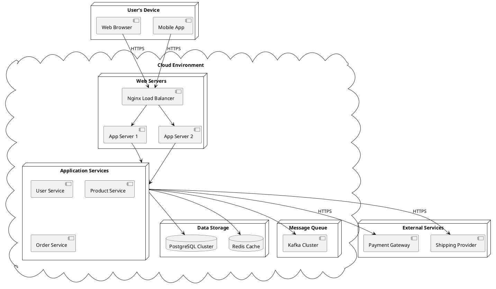
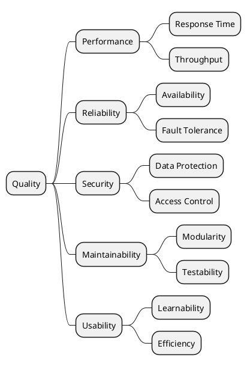

# Comprehensive arc42 Guide

## Table of Contents

1. [Introduction to arc42](#1-introduction-to-arc42)
   1.1 [What is arc42?](#11-what-is-arc42)
   1.2 [History and Philosophy](#12-history-and-philosophy)
   1.3 [Benefits of Using arc42](#13-benefits-of-using-arc42)

2. [arc42 Template Overview](#2-arc42-template-overview)
   2.1 [Structure of the Template](#21-structure-of-the-template)
   2.2 [How to Use the Template](#22-how-to-use-the-template)

3. [Introduction and Goals](#3-introduction-and-goals)
   3.1 [Requirements Overview](#31-requirements-overview)
   3.2 [Quality Goals](#32-quality-goals)
   3.3 [Stakeholders](#33-stakeholders)

4. [Architecture Constraints](#4-architecture-constraints)
   4.1 [Technical Constraints](#41-technical-constraints)
   4.2 [Organizational Constraints](#42-organizational-constraints)
   4.3 [Political Constraints](#43-political-constraints)

5. [System Scope and Context](#5-system-scope-and-context)
   5.1 [Business Context](#51-business-context)
   5.2 [Technical Context](#52-technical-context)

6. [Solution Strategy](#6-solution-strategy)
   6.1 [Defining the Solution Strategy](#61-defining-the-solution-strategy)
   6.2 [Linking Strategy to Architecture Decisions](#62-linking-strategy-to-architecture-decisions)

7. [Building Block View](#7-building-block-view)
   7.1 [Whitebox Overall System](#71-whitebox-overall-system)
   7.2 [Level 1](#72-level-1)
   7.3 [Level 2](#73-level-2)
   7.4 [Level 3](#74-level-3)

8. [Runtime View](#8-runtime-view)
   8.1 [Important Runtime Scenarios](#81-important-runtime-scenarios)
   8.2 [Sequence Diagrams](#82-sequence-diagrams)
   8.3 [State Diagrams](#83-state-diagrams)

9. [Deployment View](#9-deployment-view)
   9.1 [Infrastructure Level 1](#91-infrastructure-level-1)
   9.2 [Infrastructure Level 2](#92-infrastructure-level-2)

10. [Cross-cutting Concepts](#10-cross-cutting-concepts)
    10.1 [Domain Concepts](#101-domain-concepts)
    10.2 [Security Concepts](#102-security-concepts)
    10.3 [Performance](#103-performance)
    10.4 [Scalability](#104-scalability)
    10.5 [Reliability](#105-reliability)
    10.6 [Testability](#106-testability)

11. [Architecture Decisions](#11-architecture-decisions)
    11.1 [Documenting Architecture Decisions](#111-documenting-architecture-decisions)
    11.2 [Architecture Decision Records (ADRs)](#112-architecture-decision-records-adrs)

12. [Quality Requirements](#12-quality-requirements)
    12.1 [Quality Tree](#121-quality-tree)
    12.2 [Quality Scenarios](#122-quality-scenarios)

13. [Risks and Technical Debts](#13-risks-and-technical-debts)
    13.1 [Identifying Risks](#131-identifying-risks)
    13.2 [Managing Technical Debt](#132-managing-technical-debt)

14. [Glossary](#14-glossary)
    14.1 [Domain Terminology](#141-domain-terminology)
    14.2 [Technical Terminology](#142-technical-terminology)

15. [arc42 in Practice](#15-arc42-in-practice)
    15.1 [Tailoring arc42](#151-tailoring-arc42)
    15.2 [arc42 and Agile Methodologies](#152-arc42-and-agile-methodologies)
    15.3 [Tools for arc42](#153-tools-for-arc42)

16. [Case Studies](#16-case-studies)
    16.1 [Case Study 1: E-commerce Platform](#161-case-study-1-e-commerce-platform)
    16.2 [Case Study 2: Healthcare System](#162-case-study-2-healthcare-system)

17. [Best Practices and Tips](#17-best-practices-and-tips)
    17.1 [Getting Started with arc42](#171-getting-started-with-arc42)
    17.2 [Common Pitfalls and How to Avoid Them](#172-common-pitfalls-and-how-to-avoid-them)
    17.3 [Continuous Documentation](#173-continuous-documentation)

18. [Comparing arc42 with Other Frameworks](#18-comparing-arc42-with-other-frameworks)
    18.1 [arc42 vs. 4+1 View Model](#181-arc42-vs-41-view-model)
    18.2 [arc42 vs. C4 Model](#182-arc42-vs-c4-model)
    18.3 [arc42 vs. TOGAF](#183-arc42-vs-togaf)

19. [Future of arc42](#19-future-of-arc42)
    19.1 [Evolving Trends in Software Architecture](#191-evolving-trends-in-software-architecture)
    19.2 [arc42 Roadmap](#192-arc42-roadmap)

20. [Conclusion](#20-conclusion)

21. [References and Further Reading](#21-references-and-further-reading)

## 1. Introduction to arc42

### 1.1 What is arc42?

arc42 is a template for documentation and communication of software and system architectures. The name "arc42" is derived from "architecture" and "42" - the answer to life, the universe, and everything in Douglas Adams' "The Hitchhiker's Guide to the Galaxy".

Key points about arc42:

1. **Template**: arc42 provides a structured template for documenting software architectures.
2. **Flexible**: It can be adapted to various project sizes and types.
3. **Pragmatic**: Focuses on practical, relevant information rather than exhaustive documentation.
4. **Open Source**: Freely available for use in both commercial and non-commercial projects.

### 1.2 History and Philosophy

arc42 was created by Dr. Gernot Starke and Peter Hruschka in 2005. Their goal was to create a lightweight, practical approach to software architecture documentation.

Philosophy of arc42:

1. **Simplicity**: Keep documentation as simple and straightforward as possible.
2. **Relevance**: Focus on what's important for stakeholders.
3. **Practicality**: Emphasize practical use over theoretical completeness.
4. **Flexibility**: Adapt to different project needs and sizes.

### 1.3 Benefits of Using arc42

1. **Structured Approach**: Provides a clear structure for architecture documentation.
2. **Improved Communication**: Facilitates better understanding among team members and stakeholders.
3. **Time-saving**: Offers a ready-to-use template, saving time in setting up documentation.
4. **Comprehensive Coverage**: Ensures all important aspects of the architecture are considered.
5. **Scalability**: Can be scaled up or down based on project needs.
6. **Focus on Essential Information**: Helps avoid over-documentation by focusing on what's important.

## 2. arc42 Template Overview

### 2.1 Structure of the Template

The arc42 template consists of 12 main sections:

1. Introduction and Goals
2. Architecture Constraints
3. System Scope and Context
4. Solution Strategy
5. Building Block View
6. Runtime View
7. Deployment View
8. Cross-cutting Concepts
9. Architecture Decisions
10. Quality Requirements
11. Risks and Technical Debts
12. Glossary

Each section serves a specific purpose in documenting the software architecture.

### 2.2 How to Use the Template

1. **Start with the Essentials**: Begin by filling out the Introduction, Goals, and Context sections.
2. **Iterative Approach**: Don't try to complete all sections at once. Iterate and refine over time.
3. **Tailor to Your Needs**: Adapt the template to your project. Skip sections that aren't relevant.
4. **Keep it Updated**: Regularly review and update the documentation as the project evolves.
5. **Collaborate**: Involve team members in creating and reviewing the documentation.
6. **Use Diagrams**: Utilize visual representations where possible to enhance understanding.
7. **Link to Other Documents**: Reference existing documentation rather than duplicating information.

## 3. Introduction and Goals

This section provides an overview of the system's requirements, quality goals, and stakeholders.

### 3.1 Requirements Overview

The Requirements Overview should provide a concise summary of the system's main features and functionalities.

Key points to include:

1. **Core Functionalities**: List the primary functions the system must perform.
2. **User Groups**: Identify the main types of users the system will serve.
3. **Interfaces**: Mention any key external systems or interfaces.
4. **Business Context**: Briefly explain how the system fits into the broader business context.

Example:

```markdown
Our e-commerce platform must:
1. Allow users to browse and purchase products
2. Manage inventory and orders
3. Process secure payments
4. Provide customer support features
5. Generate sales reports for administrators
```

### 3.2 Quality Goals

Quality goals describe the top three to five quality requirements for the system.

Key aspects:

1. **Prioritization**: List quality goals in order of importance.
2. **Measurability**: Where possible, provide measurable criteria for each goal.
3. **Relevance**: Ensure goals are relevant to stakeholders and the business context.

Example:

```markdown
1. Performance: The system must handle 10,000 concurrent users with response times under 2 seconds.
2. Security: All user data and transactions must be encrypted and comply with PCI DSS standards.
3. Usability: 90% of users should be able to complete a purchase without assistance.
4. Reliability: The system should have 99.9% uptime during business hours.
```

### 3.3 Stakeholders

This subsection identifies and describes the stakeholders of the system.

Include:

1. **Stakeholder Groups**: List all relevant stakeholder groups.
2. **Roles**: Describe their roles in relation to the system.
3. **Expectations**: Outline their main expectations or concerns.

Example:

| Stakeholder | Role | Expectations |
|-------------|------|--------------|
| Customers | End users of the e-commerce platform | Easy-to-use interface, fast performance, secure transactions |
| Store Managers | Manage product listings and inventory | Efficient tools for updating products and managing stock |
| Customer Service Reps | Handle customer inquiries and issues | Access to comprehensive order and customer information |
| IT Operations | Maintain and support the system | Reliable, scalable, and easy-to-maintain system |
| Marketing Team | Analyze sales data and run promotions | Detailed reporting and campaign management features |

## 4. Architecture Constraints

Architecture constraints are restrictions on the design and implementation of the system that must be adhered to. These constraints can significantly influence architectural decisions.

### 4.1 Technical Constraints

Technical constraints are limitations imposed by technology choices, existing systems, or technical requirements.

Examples of technical constraints:

1. **Programming Language**: "The system must be developed using Java 11."
2. **Database**: "Must use Oracle Database 19c due to existing enterprise license."
3. **Integration Requirements**: "Must integrate with legacy CRM system using SOAP web services."
4. **Performance Requirements**: "Must support 1000 transactions per second."
5. **Security Standards**: "Must comply with GDPR and PCI-DSS requirements."

Document technical constraints in a clear, concise manner:

```markdown
1. Development Stack:
   - Backend: Java 11 with Spring Boot 2.5
   - Frontend: React 17 with TypeScript
   - Database: Oracle Database 19c

2. Integration:
   - Must use REST APIs for new service integrations
   - SOAP interface required for legacy CRM system

3. Deployment:
   - Must be deployable on AWS cloud infrastructure
   - Containerization using Docker is required

4. Security:
   - All data in transit and at rest must be encrypted
   - Must support OAuth 2.0 for authentication
```

### 4.2 Organizational Constraints

Organizational constraints are limitations imposed by the company's structure, processes, or policies.

Examples of organizational constraints:

1. **Budget**: "The project has a fixed budget of $500,000."
2. **Timeline**: "The system must be operational by Q3 2023."
3. **Team Structure**: "Development will be done by three distributed teams in different time zones."
4. **Compliance**: "All code must pass internal security audit before deployment."
5. **Vendor Policies**: "Only approved vendors from the company's vendor list can be used."

Document organizational constraints:

```markdown
1. Project Management:
   - Agile methodology (Scrum) with 2-week sprints
   - Monthly steering committee reviews required

2. Resourcing:
   - Maximum team size of 15 developers
   - At least 2 senior developers must be assigned to the project

3. Compliance:
   - All third-party libraries must be approved by the legal department
   - Quarterly security audits are mandatory

4. Support:
   - 24/7 support must be provided after go-live
   - Maximum 4-hour response time for critical issues
```

### 4.3 Political Constraints

Political constraints arise from internal or external political factors that influence the project.

Examples of political constraints:

1. **Stakeholder Influence**: "The CEO insists on using a specific cloud provider."
2. **Regulatory Environment**: "The system must comply with new government regulations by next year."
3. **Partnership Agreements**: "Must use Partner X's payment gateway due to existing contract."
4. **Market Positioning**: "The product must be perceived as cutting-edge in the market."

Document political constraints:

```markdown
1. Strategic Partnerships:
   - Must integrate with PartnerTech's AI module as per partnership agreement

2. Market Requirements:
   - User interface must be customizable for different geographic markets

3. Corporate Strategy:
   - System must support potential expansion into B2B market within 2 years

4. Regulatory Compliance:
   - Must adhere to upcoming EU AI regulations (expected to be enforced in 2024)
```

When documenting constraints:

1. Be specific and clear about each constraint.
2. Provide context or rationale where necessary.
3. Indicate the source or authority for each constraint.
4. Review constraints regularly, as they may change over time.
5. Consider the impact of constraints on the overall architecture and design decisions.

Understanding and clearly documenting these constraints is crucial for making informed architecture decisions and setting realistic expectations for the project.

## 5. System Scope and Context

This section defines the boundaries of the system and its interactions with its environment.

### 5.1 Business Context

The business context describes the system's place within the business environment, including its interactions with users and other systems from a business perspective.

Key elements to include:

1. **Business Processes**: Outline the main business processes the system supports.
2. **External Entities**: Identify users, user groups, and external systems that interact with your system.
3. **Inputs and Outputs**: Describe the main information flows in and out of the system.

Example diagram (using PlantUML):



Explanation:
- Customers interact with the system to browse products and place orders.
- Store Managers manage inventory.
- Customer Service Representatives handle inquiries.
- The system interacts with external Payment Gateway and Shipping Provider systems.

### 5.2 Technical Context

The technical context focuses on the system's technical interfaces with its environment.

Include:

1. **Protocols**: Specify communication protocols used (e.g., HTTP, MQTT).
2. **Data Formats**: Describe data exchange formats (e.g., JSON, XML).
3. **Technical Interfaces**: Detail APIs, database connections, etc.

Example diagram:



Explanation:
- Web Application, Mobile App, and Admin Dashboard communicate with the API Gateway using HTTPS.
- API Gateway interacts with external services using REST or GraphQL over HTTPS.
- Database connections use SQL.

## 6. Solution Strategy

The Solution Strategy section outlines the fundamental strategic decisions and solution approaches that shape the system's architecture.

### 6.1 Defining the Solution Strategy

Key aspects to address:

1. **Technology Choices**: Explain major technology decisions (e.g., programming languages, frameworks, databases).
2. **Top-level Decomposition**: Describe how the system is broken down into major components.
3. **Architectural Patterns**: Outline key architectural patterns used (e.g., microservices, event-driven architecture).
4. **Key Architectural Approaches**: Discuss approaches to meet quality goals (e.g., scalability, security).

Example:

```markdown
1. Technology Stack:
   - Backend: Java with Spring Boot for rapid development and extensive ecosystem
   - Frontend: React for building a responsive single-page application
   - Database: PostgreSQL for relational data, Redis for caching

2. Architectural Style:
   - Microservices architecture for scalability and maintainability
   - Event-driven architecture for handling real-time updates and loose coupling

3. Key Approaches:
   - API Gateway pattern for centralized request handling and security
   - CQRS (Command Query Responsibility Segregation) for optimizing read and write operations
   - Containerization with Docker for consistent deployment across environments

4. Quality Goal Strategies:
   - Performance: Implement caching layers and database indexing
   - Scalability: Use horizontal scaling for microservices and database sharding
   - Security: Implement OAuth 2.0 for authentication and encrypt sensitive data
```

### 6.2 Linking Strategy to Architecture Decisions

Explain how the solution strategy relates to key architectural decisions and quality goals.

Example:

| Strategy Element | Related Architectural Decisions | Addressed Quality Goals |
|------------------|----------------------------------|--------------------------|
| Microservices Architecture | - Decompose system into independent services<br>- Implement service discovery | Scalability, Maintainability |
| Event-driven Architecture | - Use Apache Kafka for event streaming<br>- Implement event sourcing for order processing | Performance, Loose Coupling |
| API Gateway | - Implement rate limiting<br>- Centralize authentication and authorization | Security, Scalability |
| CQRS | - Separate read and write models for product catalog<br>- Use eventual consistency for read models | Performance, Scalability |

## 7. Building Block View

The Building Block View describes the static decomposition of the system into building blocks (modules, components, subsystems, classes, interfaces, packages, libraries, frameworks, layers, partitions, tiers, functions, macros, operations, data structures, ...) as well as their dependencies.

### 7.1 Whitebox Overall System

Provide an overview of the highest level of decomposition of your system.

Example diagram:



Explanation:
Briefly describe each main component and its responsibilities.

### 7.2 Level 1

Zoom into the main building blocks of Level 1.

Example for the Order Processing component:



Provide a brief description of each subcomponent.

### 7.3 Level 2

Further decompose Level 1 components if necessary.

### 7.4 Level 3

Continue decomposition as needed, but avoid excessive detail.

## 8. Runtime View

The Runtime View describes the behavior and interactions of the system's building blocks in key scenarios.

### 8.1 Important Runtime Scenarios

List and briefly describe the most important runtime scenarios.

Example scenarios for an e-commerce system:
1. User Registration
2. Product Search and Browsing
3. Adding Items to Cart
4. Checkout Process
5. Order Fulfillment

### 8.2 Sequence Diagrams

Provide sequence diagrams for key scenarios.

Example for the Checkout Process:



Provide a brief explanation of the sequence of events.

### 8.3 State Diagrams

Include state diagrams for complex state-dependent components.

Example for Order Status:



Explain the different states and transitions.

## 9. Deployment View

The Deployment View describes the physical environment in which the system will be deployed.

### 9.1 Infrastructure Level 1

Provide an overview of the deployment architecture.

Example:



Explain the main components of the deployment architecture.

### 9.2 Infrastructure Level 2

Provide more detailed information about specific deployment aspects if necessary.

## 10. Cross-cutting Concepts

This section describes overall, principal regulations and solution ideas that are relevant in multiple parts of your system.

### 10.1 Domain Concepts

Explain the core domain concepts that are used throughout the system.

Example for an e-commerce system:
- Product
- Order
- Customer
- Cart
- Inventory

Provide a brief description or UML class diagram for key domain concepts.

### 10.2 Security Concepts

Outline the main security concepts and measures implemented in the system.

Example:
- Authentication: OAuth 2.0 with JWT tokens
- Authorization: Role-based access control (RBAC)
- Data Encryption: AES-256 for sensitive data at rest
- Communication Security: TLS 1.3 for all external communications
- Input Validation: Server-side validation for all user inputs

### 10.3 Performance

Describe strategies and concepts for achieving the required performance.

Example:
- Caching: Redis for frequently accessed data
- Database Optimization: Proper indexing and query optimization
- Content Delivery Network (CDN): For static assets
- Asynchronous Processing: Background job processing for non-critical tasks

### 10.4 Scalability

Explain how the system is designed to scale.

Example:
- Horizontal Scaling: Ability to add more instances of services
- Database Sharding: Distributing data across multiple database servers
- Stateless Design: Ensuring services can be easily scaled out
- Load Balancing: Distributing incoming traffic across multiple servers

### 10.5 Reliability

Describe concepts for ensuring system reliability.

Example:
- Redundancy: Multiple instances of critical services
- Circuit Breakers: Preventing cascading failures in distributed systems
- Monitoring and Alerting: Proactive issue detection and notification
- Data Backups: Regular backups and disaster recovery plans

### 10.6 Testability

Outline approaches to ensure the system is testable.

Example:
- Unit Testing: For individual components and functions
- Integration Testing: For interactions between different services
- End-to-End Testing: Simulating real user scenarios
- Continuous Integration: Automated testing on each code commit
- Test Data Management: Strategies for managing test data across environments

## 11. Architecture Decisions

This section documents the key architectural decisions made during the development of the system.

### 11.1 Documenting Architecture Decisions

Explain the process and format used for documenting architecture decisions.

### 11.2 Architecture Decision Records (ADRs)

Provide examples of key Architecture Decision Records.

Example ADR:

```markdown
# Use Microservices Architecture

## Status
Accepted

## Context
We need to design an architecture that allows for scalability, maintainability, and fast feature development.

## Decision
We will adopt a microservices architecture for our e-commerce platform.

## Consequences
Positive:
- Improved scalability and fault isolation
- Easier to develop, test, and deploy individual services
- Enables use of different technologies for different services

Negative:
- Increased complexity in service communication and data consistency
- Need for more sophisticated deployment and monitoring tools
- Potential performance overhead due to network communication between services
```

## 12. Quality Requirements

This section specifies and quantifies the quality requirements for the system.

### 12.1 Quality Tree

Provide a hierarchical model of the system's quality goals.

Example:



### 12.2 Quality Scenarios

Describe concrete quality scenarios that specify the quality requirements.

Example:

| Quality Attribute | Scenario | Measure |
|-------------------|----------|---------|
| Performance | The system responds to a product search query | Within 500ms for 95% of requests under normal load |
| Reliability | The system continues to function when a single service fails | 99.9% availability over a month |
| Security | User attempts to access unauthorized data | Access is denied and the attempt is logged |
| Scalability | The system handles increased load during a flash sale | Supports 10x normal traffic without degradation |

## 13. Risks and Technical Debts

This section identifies and describes potential risks and known technical debts in the system.

### 13.1 Identifying Risks

List and describe potential risks to the project or system.

Example:

1. Dependency on Third-Party Services: Risk of service disruption if external payment gateway experiences downtime.
2. Data Privacy Compliance: Risk of non-compliance with evolving data protection regulations.
3. Scalability Challenges: Risk of performance degradation during unexpected traffic spikes.
4. Technology Obsolescence: Risk of using technologies that may become outdated or unsupported.

### 13.2 Managing Technical Debt

Describe known technical debts and plans for addressing them.

Example:

1. Legacy Authentication System: Plan to replace with OAuth 2.0 in next quarter.
2. Lack of Automated Tests: Gradually increase test coverage, starting with critical components.
3. Outdated Database Schema: Schedule database refactoring sprint in upcoming release.

## 14. Glossary

This section provides definitions for domain and technical terms used throughout the documentation.

### 14.1 Domain Terminology

| Term | Definition |
|------|------------|
| SKU | Stock Keeping Unit, a unique identifier for each distinct product and service that can be purchased |
| Fulfillment | The process of receiving, packaging, and shipping orders to customers |
| Backorder | An order for a good or service that cannot be filled at the current time due to a lack of available supply |

### 14.2 Technical Terminology

| Term | Definition |
|------|------------|
| API | Application Programming Interface, a set of definitions and protocols for building and integrating application software |
| CQRS | Command Query Responsibility Segregation, a pattern separating read and update operations for a data store |
| JWT | JSON Web Token, a compact and self-contained way for securely transmitting information between parties as a JSON object |

## 15. arc42 in Practice

This section provides guidance on how to effectively use arc42 in real-world scenarios.

### 15.1 Tailoring arc42

Explain how to adapt arc42 to different project sizes and types.

- For small projects: Focus on key sections like context, solution strategy, and building blocks.
- For large projects: Use all sections and consider creating separate documents for detailed subsystems.

### 15.2 arc42 and Agile Methodologies

Describe how to integrate arc42 with agile development processes.

- Iterative documentation: Update arc42 sections as part of each sprint.
- Living document: Treat architecture documentation as a continuously evolving artifact.
- Collaborative approach: Involve the entire team in architecture discussions and documentation.

### 15.3 Tools for arc42

List and briefly describe tools that can be used with arc42:

1. **Confluence**: Wiki-style platform for collaborative documentation.
2. **draw.io**: Free diagramming tool that integrates with various platforms.
3. **PlantUML**: Text-based UML diagram creation tool.
4. **AsciiDoc**: Lightweight markup language for writing documentation.
5. **Markdown**: Simple and widely-supported markup language.
6. **Enterprise Architect**: Comprehensive UML modeling and design tool.
7. **Structurizr**: Tool for creating software architecture diagrams as code.
8. **DocToolChain**: Automates the generation of software architecture documentation.

## 16. Case Studies

### 16.1 Case Study 1: E-commerce Platform

Provide a concise example of how arc42 was applied to document the architecture of an e-commerce platform.

1. **Introduction and Goals**: Outline the main requirements and quality goals.
2. **Constraints**: Discuss technical and organizational constraints.
3. **Context**: Show the system's interaction with users and external services.
4. **Solution Strategy**: Explain the choice of a microservices architecture.
5. **Building Block View**: Present the main components of the e-commerce system.
6. **Runtime View**: Illustrate key scenarios like the checkout process.
7. **Deployment View**: Describe the cloud-based deployment architecture.
8. **Cross-cutting Concepts**: Discuss security measures and scalability approaches.
9. **Architecture Decisions**: Document the decision to use event-driven architecture.
10. **Quality Requirements**: Specify performance and reliability metrics.
11. **Risks and Technical Debts**: Identify potential scalability challenges.

### 16.2 Case Study 2: Healthcare System

Provide another example applying arc42 to a healthcare system architecture.

1. **Introduction and Goals**: Emphasize patient data management and regulatory compliance.
2. **Constraints**: Highlight strict data privacy regulations and integration with legacy systems.
3. **Context**: Show interactions with various healthcare providers and insurance systems.
4. **Solution Strategy**: Explain the adoption of a modular monolith architecture.
5. **Building Block View**: Present components like patient records, appointment scheduling, and billing.
6. **Runtime View**: Illustrate the process of scheduling an appointment and updating medical records.
7. **Deployment View**: Describe on-premises deployment with strict security measures.
8. **Cross-cutting Concepts**: Discuss HIPAA compliance measures and data encryption strategies.
9. **Architecture Decisions**: Document the choice of using FHIR standards for interoperability.
10. **Quality Requirements**: Specify data accuracy and system availability requirements.
11. **Risks and Technical Debts**: Identify challenges in integrating with various external systems.

## 17. Best Practices and Tips

### 17.1 Getting Started with arc42

1. **Start Small**: Begin with the most crucial sections like context and building blocks.
2. **Use Templates**: Leverage arc42 templates to structure your documentation.
3. **Collaborate Early**: Involve team members in architecture discussions from the start.
4. **Focus on Communication**: Prioritize clear, concise communication over exhaustive details.
5. **Iterate**: Don't aim for perfection in the first draft; improve the documentation iteratively.

### 17.2 Common Pitfalls and How to Avoid Them

1. **Over-documentation**: Focus on essential information; avoid unnecessary details.
2. **Outdated Documentation**: Regularly review and update the architecture documentation.
3. **Ignoring Constraints**: Clearly document and consider all constraints in your design.
4. **Neglecting Stakeholders**: Ensure all relevant stakeholders are considered and consulted.
5. **Inconsistent Terminology**: Maintain a consistent glossary throughout the documentation.

### 17.3 Continuous Documentation

1. **Integration with Development Process**: Make documentation updates part of the regular development cycle.
2. **Version Control**: Keep architecture documentation in version control alongside the code.
3. **Review Process**: Establish a review process for architecture documentation changes.
4. **Traceability**: Maintain links between architecture decisions and implementation.
5. **Automated Updates**: Use tools to automatically update diagrams and metrics where possible.

## 18. Comparing arc42 with Other Frameworks

### 18.1 arc42 vs. 4+1 View Model

| Aspect | arc42 | 4+1 View Model |
|--------|-------|----------------|
| Structure | 12 sections covering various aspects | 5 main views: Logical, Process, Development, Physical, and Scenarios |
| Flexibility | Highly flexible and adaptable | More rigid structure |
| Level of Detail | Can be tailored from high-level to detailed | Tends to be more high-level |
| Ease of Use | Generally easier for beginners | Requires more architectural expertise |

### 18.2 arc42 vs. C4 Model

| Aspect | arc42 | C4 Model |
|--------|-------|----------|
| Focus | Comprehensive documentation | Primarily on system visualization |
| Abstraction Levels | Flexible, can cover multiple levels | Four specific levels: Context, Containers, Components, and Code |
| Diagram Types | Various, including UML | Specific diagram types for each level |
| Scope | Covers both technical and non-technical aspects | More focused on technical architecture |

### 18.3 arc42 vs. TOGAF

| Aspect | arc42 | TOGAF |
|--------|-------|-------|
| Scope | Software architecture documentation | Enterprise architecture framework |
| Complexity | Relatively simple and straightforward | More complex and comprehensive |
| Process | Flexible, no strict process | Defined Architecture Development Method (ADM) |
| Target Audience | Development teams and technical stakeholders | Enterprise architects and business stakeholders |
| Learning Curve | Shorter, easier to adopt | Steeper, requires more time to master |

## 19. Future of arc42

### 19.1 Evolving Trends in Software Architecture

1. **Increased Focus on Cloud-Native Architectures**: Adapting arc42 to better document cloud-native and serverless architectures.
2. **AI and Machine Learning Integration**: Incorporating guidance for documenting AI/ML components and data flows.
3. **IoT and Edge Computing**: Extending arc42 to address the unique aspects of IoT architectures.
4. **Enhanced Security Documentation**: Evolving to provide more comprehensive security architecture documentation.
5. **Sustainability Considerations**: Incorporating elements to document the environmental impact of architectural decisions.

### 19.2 arc42 Roadmap

While arc42 is a community-driven template without a formal roadmap, potential future enhancements could include:

1. **Interactive Documentation**: Tools for creating more interactive and navigable architecture documentation.
2. **Integration with DevOps Practices**: Closer alignment with CI/CD pipelines and infrastructure-as-code.
3. **Automated Consistency Checks**: Tools to verify consistency across different sections of the documentation.
4. **Collaboration Features**: Enhanced support for collaborative editing and reviewing of architecture documentation.
5. **Versioning and Tracking**: Better mechanisms for versioning architecture documentation and tracking changes over time.

## 20. Conclusion

arc42 provides a flexible and practical template for documenting software and system architectures. Its strength lies in its adaptability to various project sizes and types, focus on essential information, and support for agile methodologies. By following arc42's structure and best practices, teams can create clear, comprehensive, and maintainable architecture documentation that enhances communication and supports effective decision-making throughout the software development lifecycle.

## 21. References and Further Reading

1. Starke, G., & Hruschka, P. (2022). arc42 by Example: Software Architecture Documentation in Practice. Leanpub.
2. Starke, G. (2019). Effective Software Architectures: A Practical Guide. Leanpub.
3. arc42 Official Website: [https://arc42.org/](https://arc42.org/)
4. Keeling, M. (2017). Design It!: From Programmer to Software Architect. Pragmatic Bookshelf.
5. Ford, N., Richards, M., Sadalage, P., & Dehghani, Z. (2021). Software Architecture: The Hard Parts. O'Reilly Media.
6. Bass, L., Clements, P., & Kazman, R. (2021). Software Architecture in Practice. Addison-Wesley Professional.
7. Brown, S. (2020). The C4 Model for Visualising Software Architecture. [https://c4model.com/](https://c4model.com/)
8. The Open Group. (2018). TOGAF Standard, Version 9.2. [https://www.opengroup.org/togaf](https://www.opengroup.org/togaf)

This comprehensive guide provides a thorough overview of arc42, its application, best practices, and its place in the broader context of software architecture documentation. It serves as both an introduction for newcomers and a reference for experienced practitioners using arc42 in their projects.

